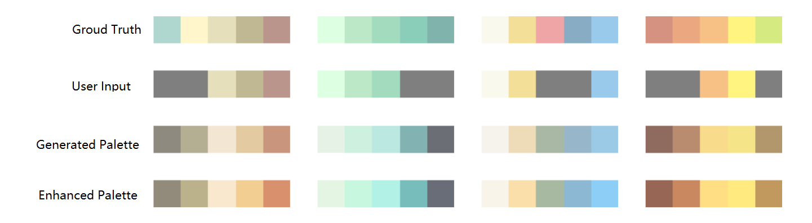

# AutoColor
12th Intel Cup National Collegiate Software Innovation Contest (AI-Based Web Application) project. Aiming to build a color scheme design tool for mobile application UI designers or APP developers.

AutoColor Web Application:

# Feature
## Palette Generation
Generate 5-color palette according to theme color with a GAN model. You can specify one or more colors, and the modle will generate the rest. The generated color scheme is enhanced in terms of saturation to make it more presentable.
Below are some results from the model.

> Note: the gray colors in `User Input` stand for colors needed to be generated.

We applied [a quantitative model](https://www.dgp.toronto.edu/~donovan/color/colorcomp.pdf) to evaluate the quality of the palette we generate.

Below are the score distribution graph, comparing our palette with palettes from [Adobe](https://color.adobe.com/zh/create), [Colormind](http://colormind.io/) and random colors.

## Color Scheme Extraction
We applied MMCQ to extract color scheme from images.

## Color Scheme Classification
Generate color scheme with different styles: fresh, cute, technology. We simply trained a classifier to categorize different schemes. The code of classifer can be found [here](https://github.com/Ti-tanium/Color-Scheme-Style-Classifier)
